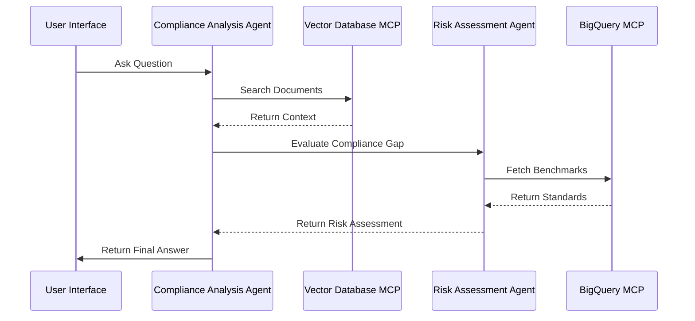

A2A Communication Schema (JSON)
Agents should communicate using a structured message format that includes a header (for routing) and a payload (for the actual data).

{
  "header": {
    "sender": "ComplianceAnalysisAgent",
    "receiver": "RiskAssessmentAgent",
    "timestamp": "2026-06-08T02:00:00Z",
    "message_id": "MSG-99283-X"
  },
  "payload": {
    "action": "EVALUATE_COMPLIANCE_GAP",
    "context": {
      "user_query": "Is our retention policy GDPR compliant?",
      "retrieved_chunks": [
        {"doc_id": "GDPR_Policy_v1", "text": "Data is retained for 7 years post-contract."},
        {"doc_id": "ISO27001_v2", "text": "Retention must not exceed business necessity."}
      ]
    },
    "metadata": {
      "priority": "high",
      "compliance_standard": "GDPR"
    }
  }
}

The Request (Compliance Analysis Agent): The agent identifies that the user query involves complex policy interpretation. It pauses the user's chat thread and triggers the RiskAssessmentAgent by sending the EVALUATE_COMPLIANCE_GAP action.
The Processing (Risk Assessment Agent): * It parses the retrieved_chunks from the message.
It executes a query against the BigQuery MCP to fetch the "Standard Benchmarks" for GDPR Article 17.
It compares the policy text (7 years) vs the requirement (Article 17 limits).
The Response (Risk Assessment Agent): It returns a JSON object containing a risk_level and a justification string, which the ComplianceAnalysisAgent then uses to generate the final human-readable answer.

